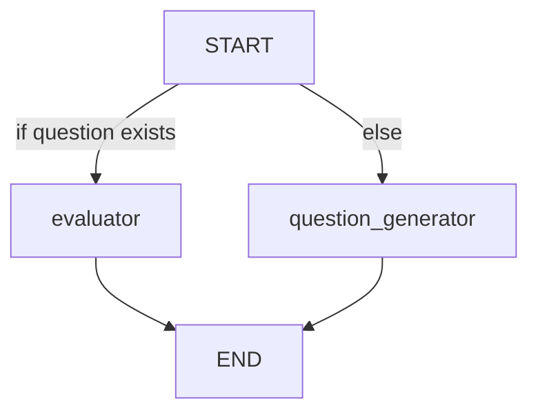

📄 TalentScout: AI-Powered Hiring Assistant
TalentScout is an intelligent, interactive hiring assistant that automates candidate evaluation through LLM-based interviews and feedback. It features:

💬 AI-generated interview questions based on a candidate's skill and experience.

🧠 Automatic evaluation of responses using a structured rubric.

📊 Admin dashboard for reviewing candidate data and exporting reports.


📌 Table of Contents

🚀 Demo

📁 Project Structure

🔧 Features

🛠️ Tech Stack

📦 Installation

💡 Usage

🧠 LangGraph Workflow

🔒 Admin Access

🗃️ Database Schema

📌 Future Improvements


🚀 Demo
Candidate Interface and Admin Panel run as two Streamlit apps.
Visit both pages using the sidebar or deploy them separately.


📁 Project Structure
pgsql
Copy
Edit
TalentScout_Hiring_Assistant/
├── pages/
│   ├── 1_interview.py          # Candidate interview app
│   └── 2_admin.py              # Admin panel
├──graph
│   ├── agent.py                # LangGraph nodes: evaluator, question generator
│   ├── workflow.py             # LangGraph flow configuration
│   └── state.py                # LangGraph state + Evaluator format
├── utils
│   ├── prompts.py              # LLM prompts
│   └──models.py                # Groq model wrapper
├── init_db.py                 # Database setup
├── home.py                    # Streamlit homepage
├── talentscout.db             # SQLite database (auto-generated)
├── requirements.txt           # Python dependencies
└── README.md                  # Project documentation


🔧 Features

✅ Candidate Assessment
Collects personal info, experience, and skills.

Dynamically generates 5 domain-specific questions.

Uses LangGraph + LLM for intelligent question generation and response evaluation.

📊 Admin Panel

Secure login with hardcoded credentials (to be improved with DB).

View all candidate profiles and responses.

Export data as CSV.

🧠 LLM Capabilities

Uses Groq + Llama 3 to:

Generate conceptual questions (no code).

Evaluate answers across correctness, grammar, sentiment, confidence, and length.

💾 Persistent Storage

Data stored in SQLite3:

candidates table

responses table

🛠️ Tech Stack

Category	            Tech / Tool
🖥 Frontend UI	        Streamlit
🧠 LLM Inference	   LangChain + Groq + Llama 3
⚙ Workflow Engine	   LangGraph
🗃 Database             SQLite3
📜 Prompt Templates	   LangChain PromptTemplate
🐍 Language	           Python 3.11+

📦 Installation

```bash
git clone https://github.com/vinaykumarreddy9/talentscout-hiring-assistant.git
cd talentscout-hiring-assistant

# Install dependencies
pip install -r requirements.txt

# Set your GROQ API Key in .env
echo "GROQ_API_KEY=your_groq_api_key" > .env

# Initialize the DB
python init_db.py
```

💡 Usage

It is an multi page application. Run the project or deploy on platforms like Render:

### Launch App

```bash
streamlit run home.py
```

🧠 LangGraph Workflow
Defined in workflow.py:


Nodes:
intent_router_node: Decides route based on state["question"].

question_generator: Uses skill, experience, complexity.

evaluator: Returns structured response using Pydantic schema.

🔒 Admin Access
Field	        Value
Email	        admin@talentscout.ai
Password	    admin123

Credentials are hashed using SHA-256.

🗃️ Database Schema
candidates Table
Field	            Type
candidate_id	    TEXT (PK)
name	            TEXT
email	            TEXT
phone	            TEXT
location	        TEXT
position	        TEXT
experience	        TEXT
skills	            TEXT (CSV)
session_time	    TEXT

responses Table
Field	            Type
id	                INTEGER (PK)
candidate_id	    TEXT (FK)
skill	            TEXT
question	        TEXT
answer	            TEXT
sentiment	        TEXT
correctness	        INTEGER
length_score	    INTEGER
grammar_score	    INTEGER
confidence_score	INTEGER

📌 Future Improvements

🔐 Secure admin login with database-based auth

📈 Visual analytics for candidate responses

📬 Email notifications to candidates

🧩 Skill-level tagging and difficulty analysis

☁️ Switch to Postgres or cloud DB for scalability